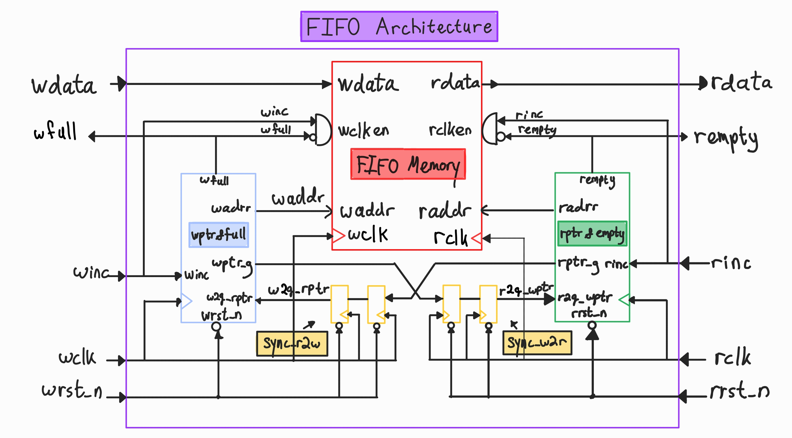
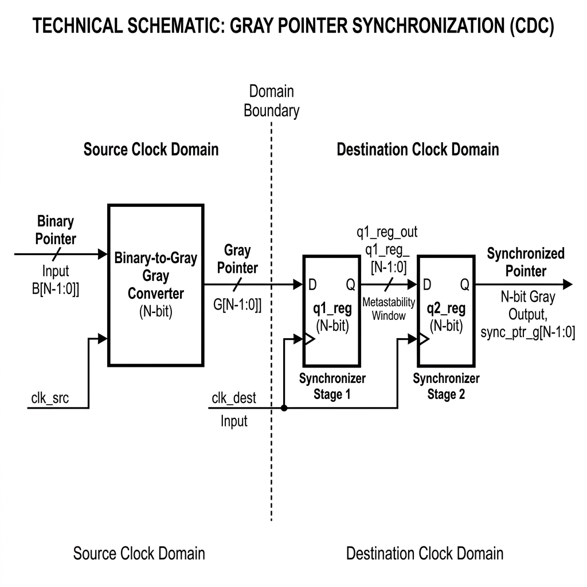
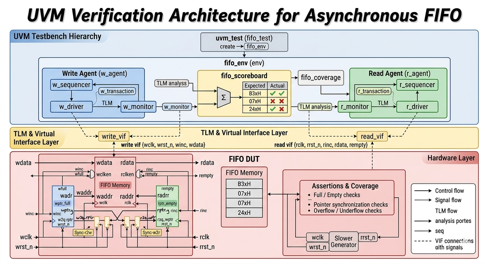
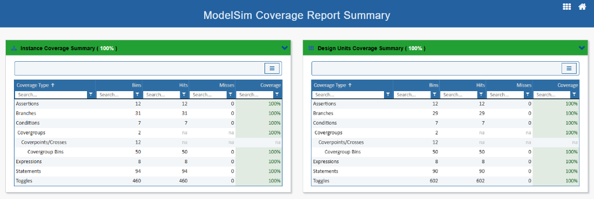
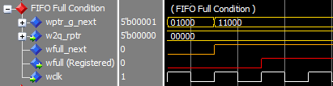
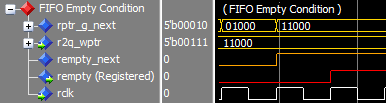

# Asynchronous FIFO Design & UVM Verification Environment

> High-performance asynchronous FIFO implemented in synthesizable VHDL and verified using a complete SystemVerilog UVM environment with constrained-random testing, assertions, scoreboarding, and functional coverage.

---

# Overview

This project implements a parameterized asynchronous FIFO (First-In, First-Out) buffer designed for safe data transfer between independent clock domains.

The design addresses critical clock-domain crossing (CDC) challenges including:
- Metastability mitigation
- Multi-bit synchronization
- Gray-code pointer transfer
- Reliable full/empty flag generation
- Independent asynchronous read/write operation

The verification environment was developed using the Universal Verification Methodology (UVM) and includes:
- Constrained-random stimulus generation
- Assertion-based verification (SVA)
- Functional coverage
- Self-checking scoreboard architecture
- Randomized asynchronous clock behavior

---

# Why Asynchronous FIFOs Matter

Asynchronous FIFOs are widely used in modern digital systems whenever data must safely cross between unrelated clock domains.

Unlike synchronous FIFOs, asynchronous FIFOs must handle:
- Unsynchronized clocks
- Metastability risks
- Safe pointer synchronization
- Correct status flag generation despite CDC latency

To minimize synchronization errors, Gray-code pointers are used because only a single bit changes between adjacent values.

Gray-code conversion used in the design:

f_{gray}=b\oplus(b>>1)

The synchronized Gray pointers are transferred across domains using a 2-stage flip-flop synchronizer chain.

---

# Project Structure

```text
FIFO/
│
├── rtl/                   # Synthesizable VHDL design files
│   ├── fifo.vhd
│   ├── fifo_mem.vhd
│   ├── fifo_ptr.vhd
│   ├── fifo_r_ptr.vhd
│   ├── fifo_w_ptr.vhd
│   └── fifo_synchronizer.vhd
│
├── uvm/                   # UVM verification environment
│   ├── fifo_tb.sv
│   ├── fifo_top.sv
│   ├── fifo_if.sv
│   ├── fifo_env.sv
│   ├── fifo_scoreboard.sv
│   ├── fifo_transaction.sv
│   ├── fifo_test.sv
│   └── fifo_sva.sv
│
└── sim/
    └── run.do
```

---

# FIFO Architecture

## Top-Level Architecture



### Key Design Features
- Dual-clock asynchronous FIFO
- Independent read/write clock domains
- Gray-code pointer generation
- 2FF synchronizer chain
- Parameterized FIFO depth and width
- Dual-port memory architecture
- Safe full/empty detection logic

---

# Pointer Synchronization

## Gray-Code Synchronization Path



### Synchronization Strategy
- Binary pointers are converted to Gray-code
- Gray pointers are synchronized across clock domains
- 2-stage flip-flop synchronizers reduce metastability propagation risk
- Full/empty flags are generated using synchronized pointers

---

# Verification Environment

## UVM Testbench Architecture



## UVM Verification Architecture

The testbench uses industry-standard UVM methodology:
- **Testbench Layer**: Write and Read agents generate transactions
- **TLM & VIF Layer**: Translates UVM transactions to RTL signals
- **Hardware Layer**: DUT includes FIFO memory with CDC synchronizers
- **Scoreboard**: Compares expected vs. actual data with coverage metrics

### Verification Components
- UVM driver
- UVM monitor
- UVM sequencer
- Self-checking scoreboard
- Functional coverage collector
- SystemVerilog assertions
- Constrained-random stimulus generation

---

# Verification Strategy

The DUT was verified using both directed and constrained-random testing methodologies.

## Features Verified

| Verification Scenario | Status |
|---|---|
| FIFO Full Detection | ✅ |
| FIFO Empty Detection | ✅ |
| Overflow Protection | ✅ |
| Underflow Protection | ✅ |
| Simultaneous Read/Write | ✅ |
| Pointer Wraparound | ✅ |
| Asynchronous Clock Ratios | ✅ |
| Gray Pointer Correctness | ✅ |
| Reset Recovery | ✅ |
| CDC Synchronization Behavior | ✅ |

---

# Assertions (SVA)

SystemVerilog Assertions were used to verify critical FIFO behavior including:
- Illegal write detection during FULL condition
- Illegal read detection during EMPTY condition
- Pointer progression correctness
- Gray-code transition correctness
- Full/empty flag behavior
- Reset consistency

---

# Functional Coverage

The verification environment includes functional coverage collection using SystemVerilog covergroups.

## Coverage Goals
- FIFO state transitions
- Full/empty conditions
- Pointer wraparound
- Simultaneous read/write operations
- Clock ratio variation
- Reset behavior

## Coverage Results

| Coverage Type | Result |
|---|---|
| Functional Coverage | 100% |
| Assertion Coverage | 100% |



---

# Simulation Waveforms

## FIFO Full Condition



## FIFO Empty Condition



## Gray Pointer Synchronization


---

# Running Simulation

## ModelSim / QuestaSim

```bash
cd sim
vsim -do run.do
```

---

# Tools & Technologies

## Design
- VHDL
- Clock Domain Crossing (CDC)
- Gray-code synchronization
- Dual-port memory architecture

## Verification
- SystemVerilog
- UVM (Universal Verification Methodology)
- SVA (SystemVerilog Assertions)
- Functional Coverage
- Constrained-Random Verification

## Simulation
- ModelSim / QuestaSim

---

# Lessons Learned

This project provided practical experience in:
- CDC-safe digital design
- Metastability mitigation techniques
- Gray-code synchronization
- UVM-based verification methodology
- Assertion-based verification
- Functional coverage closure
- Debugging asynchronous systems
- Scoreboard-based checking
- Simulation automation using Tcl scripts

---

# Future Improvements

Potential future extensions include:
- Parameterized regression testing
- Formal verification integration
- FPGA implementation
- AXI-stream interface support
- Continuous Integration (CI) automation
- Multi-channel FIFO support

---

# Author

Shlomo Abrams

Electrical Engineering Student  
Digital Design & Verification Enthusiast

GitHub:
https://github.com/ShlomoAbrams
