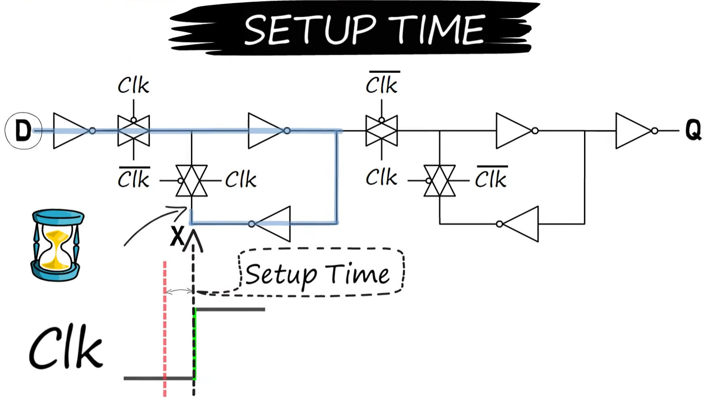
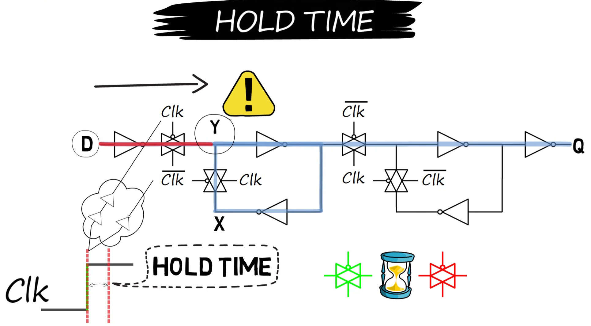
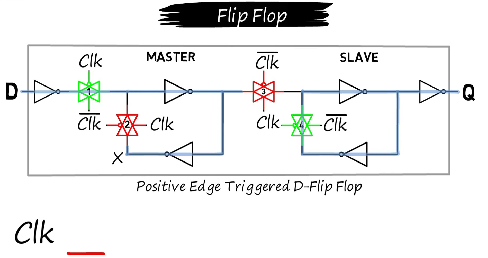
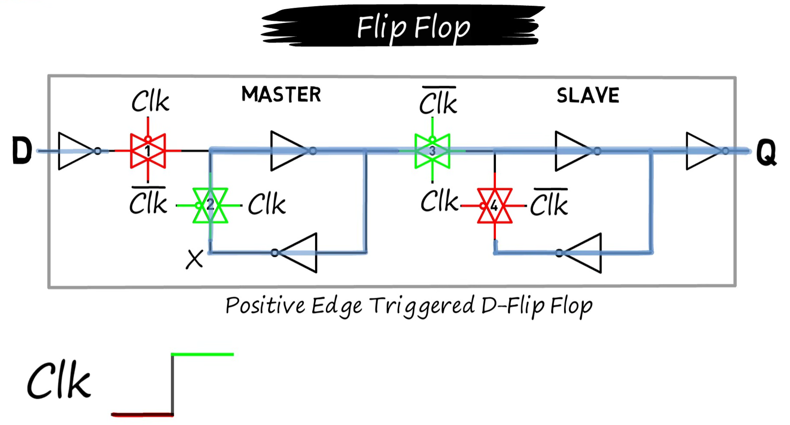
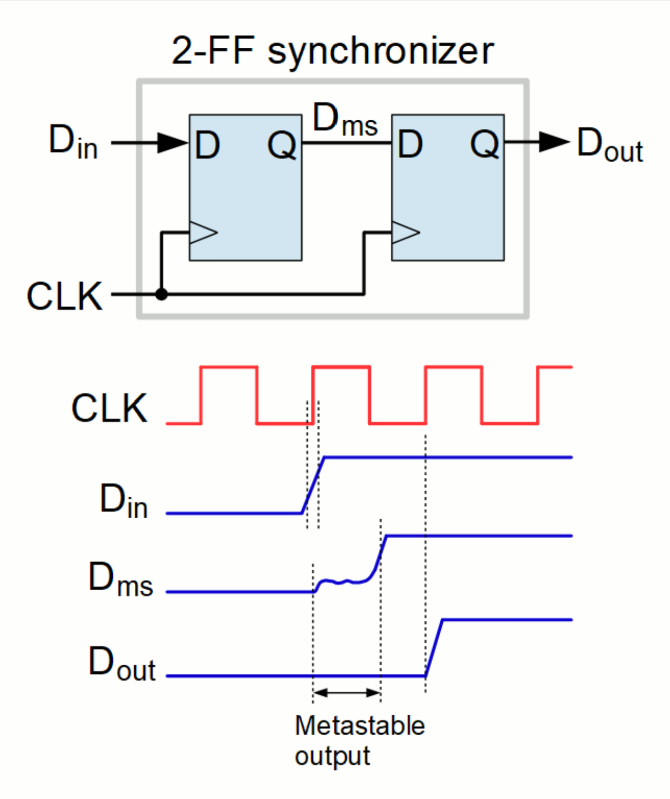
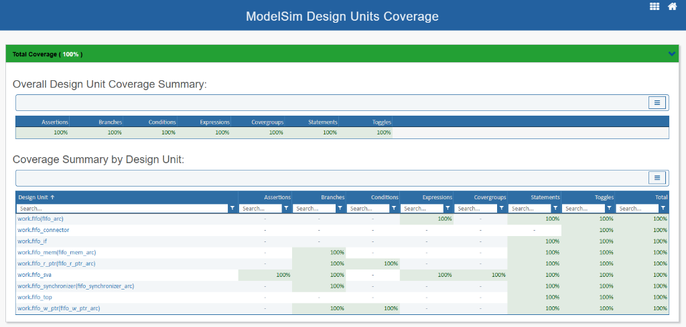
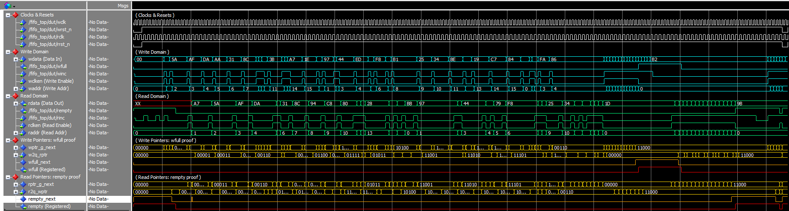
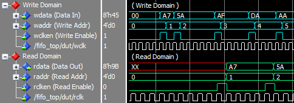
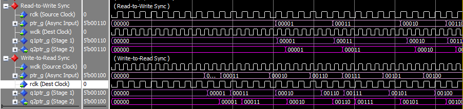
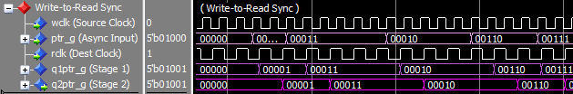

# Asynchronous FIFO Design & UVM Verification Environment

> Parameterized Asynchronous FIFO implemented in VHDL and verified using a SystemVerilog UVM environment with constrained-random testing, assertions (SVA), scoreboarding, and functional coverage.


---

# Table of Contents
- [Project Overview](#project-overview)
- [Why Asynchronous FIFOs Matter](#why-asynchronous-fifos-matter)
- [Project Structure](#project-structure)
- [Quick Start: Automated Verification & Simulation](#quick-start-automated-verification--simulation)
- [FIFO Architecture](#fifo-architecture)
- [Clock Domain Crossing (CDC) & Pointer Synchronization](#clock-domain-crossing-cdc--pointer-synchronization)
  - [1. Preventing Multi-Bit Skew Corruption (Gray Code)](#1-preventing-multi-bit-skew-corruption-gray-code)
  - [2. Preventing Metastability (2-Stage FF Synchronizers)](#2-preventing-metastability-2-stage-ff-synchronizers)
  - [Asynchronous CDC Latency & Flag Pessimism](#asynchronous-cdc-latency--flag-pessimism)
- [Verification Environment](#verification-environment)
- [Verification Strategy](#verification-strategy)
- [SystemVerilog Assertions (SVA)](#systemverilog-assertions-sva)
- [Functional & Structural Coverage](#functional--structural-coverage)
- [Waveform Analysis & Simulation Traces](#waveform-analysis--simulation-traces)
- [Author](#author)

---

# Project Overview

This project implements a parameterized asynchronous FIFO (First-In, First-Out) buffer designed for safe data transfer between independent clock domains.

The design addresses critical clock-domain crossing (CDC) challenges including:
- Metastability mitigation via 2FF synchronizer chains
- Multi-bit synchronization using Gray-code pointer transfer
- Reliable full/empty flag generation with safe pessimistic latency
- Independent asynchronous read and write domain operations

The verification environment was developed using the Universal Verification Methodology (UVM) and includes:
- Constrained-random stimulus generation
- Assertion-based verification (SVA)
- Functional coverage with covergroups and crosses
- Self-checking scoreboard architecture
- Randomized asynchronous clock period sweeps

---

# Why Asynchronous FIFOs Matter

Asynchronous FIFOs are widely used in modern digital systems whenever data must safely cross between unrelated clock domains.

Unlike synchronous FIFOs, asynchronous FIFOs must handle:
- Unsynchronized clocks with arbitrary frequency ratios
- Metastability risks on asynchronous flip-flop setup/hold violations
- Safe multi-bit pointer synchronization across boundaries
- Correct status flag generation despite CDC latency

To minimize synchronization errors, Gray-code pointers are used because only a single bit changes between adjacent values.

The Gray-code conversion used in the design:

$$f_{\text{gray}} = b \oplus (b \gg 1)$$

The synchronized Gray pointers are transferred across domains using a 2-stage flip-flop synchronizer chain.

---

# Project Structure

```text
FIFO/
│
├── rtl/                       # Synthesizable VHDL design files
│   ├── fifo.vhd               # Top-level FIFO wrapper entity
│   ├── fifo_mem.vhd           # Dual-port RAM array
│   ├── fifo_r_ptr.vhd         # Read pointer & empty flag logic
│   ├── fifo_w_ptr.vhd         # Write pointer & full flag logic
│   └── fifo_synchronizer.vhd  # 2-Stage Flip-Flop (2FF) synchronizer
│
├── uvm/                       # UVM verification environment
│   ├── fifo_env.sv            # Top UVM environment container
│   ├── fifo_if.sv             # SystemVerilog interface with clocking blocks
│   ├── fifo_pkg.sv            # Package importing UVM and components
│   ├── fifo_r_agent.sv        # Read agent encapsulating driver, monitor, sequencer
│   ├── fifo_r_drain_sequence.sv
│   ├── fifo_r_driver.sv       # Read domain UVM driver
│   ├── fifo_r_monitor.sv      # Read domain UVM monitor
│   ├── fifo_r_sequence.sv     # Basic read sequence
│   ├── fifo_reset_recovery_test.sv # Reset recovery stress test
│   ├── fifo_scoreboard.sv     # Self-checking data & flag scoreboard
│   ├── fifo_sva.sv            # Concurrent SystemVerilog assertions
│   ├── fifo_tb.sv             # Legacy SystemVerilog testbench
│   ├── fifo_test.sv           # Base UVM test and transaction test
│   ├── fifo_top.sv            # Top-level verification module
│   ├── fifo_transaction.sv   # UVM sequence item definition
│   ├── fifo_w_agent.sv        # Write agent encapsulating driver, monitor, sequencer
│   ├── fifo_w_burst_sequence.sv
│   ├── fifo_w_driver.sv       # Write domain UVM driver
│   ├── fifo_w_monitor.sv      # Write domain UVM monitor
│   └── fifo_w_sequence.sv     # Basic write sequence
│
└── sim/
    ├── run.do                 # Parameterized ModelSim TCL simulation script
    ├── run.ps1                # Automated quiet PowerShell test runner script
    └── run.bat                # Windows Batch wrapper script (Quiet Mode)
```

The VHDL design files can be found in [rtl/](file:///c:/Users/shlom/Documents/University/FIFO/rtl/) and the UVM verification suite in [uvm/](file:///c:/Users/shlom/Documents/University/FIFO/uvm/).

---

# Quick Start: Automated Verification & Simulation

## Dynamic Simulation Parameters

You can dynamically configure **all 4 simulation parameters** at runtime without re-compiling the design:

| Parameter | Description | PowerShell Switch | Batch Position | Default Value | Example Values |
| :--- | :--- | :--- | :---: | :---: | :---: |
| **`Wclk`** | Write Clock Half-Period (ns) | `-Wclk <ns>` | Position 2 | `5` (100 MHz) | `2` (250 MHz) |
| **`Rclk`** | Read Clock Half-Period (ns) | `-Rclk <ns>` | Position 3 | `7` (~71.4 MHz) | `10` (50 MHz) |
| **`DataWidth`** | Hardware & UVM Data Bus Width (bits) | `-DataWidth <bits>` | Position 4 | `8` bits | `5` bits / `16` bits / `32` bits |
| **`AddrWidth`** | Address Width / Memory Depth ($\text{Depth} = 2^{\text{AddrWidth}}$) | `-AddrWidth <bits>` | Position 5 | `4` (16 items) | `5` (32 items) / `6` (64 items) |

---

### Option 1: Automated Test Runner (Command Line - Quiet Mode)

1. Open terminal and navigate to your `sim` directory:
   ```bash
   cd sim
   ```
2. Run simulation with default or custom parameters:
   ```bash
   # 1. Run basic test (default settings)
   .\run.bat

   # 2. Custom Parameters Run (Syntax: .\run.bat [TestName] [Wclk] [Rclk] [DataWidth] [AddrWidth])
   .\run.bat fifo_reset_recovery_test 2 10 5 5

   # PowerShell alternative:
   .\run.ps1 -TestName fifo_reset_recovery_test -Wclk 2 -Rclk 10 -DataWidth 16 -AddrWidth 5
   ```

---

### Option 2: Interactive ModelSim GUI (Waveforms)

1. Open ModelSim SE and navigate to your `sim` directory:
   ```bash
   cd sim
   ```
2. Run simulation with default or custom parameters:
   ```tcl
   # 1. Run basic test (default settings)
   do run.do

   # 2. Custom Parameters Run
   set TESTNAME fifo_reset_recovery_test; set WCLK_HALF 2; set RCLK_HALF 10; set DATA_WIDTH 5; set ADDR_WIDTH 5; do run.do
   ```

---

# FIFO Architecture

## Top-Level Architecture


### Key Design Features
- Dual-clock asynchronous FIFO
- Independent read/write clock domains
- Gray-code pointer generation
- 2FF synchronizer chain
- Parameterized FIFO depth and width
- Dual-port memory architecture
- Safe full/empty detection logic

---

# Clock Domain Crossing (CDC) & Pointer Synchronization

## Gray-Code Synchronization Path


### Synchronization Strategy
- Binary pointers are converted to Gray-code combinationally.
- Gray pointers are transferred across independent clock domains via 2FF synchronizers.
- Full and empty flags are generated by comparing local next Gray pointers against synchronized opposite Gray pointers.

---

## CDC Design Challenges & Mitigation

Asynchronous clock domain crossings (CDC) pose two fundamental hardware challenges: **multi-bit pointer skew** and **metastability**. Below is a detailed breakdown of how this FIFO design mitigates both risks.

### 1. Preventing Multi-Bit Skew Corruption (Gray Code)

In a clock domain crossing, transferring multi-bit signals (such as binary-coded write/read pointers) is extremely dangerous due to **wire/routing skew** and differences in path delays.

#### The Risk: Multi-Bit Binary Skew
When a binary pointer increments, multiple bits can change simultaneously. For example, when a 3-bit binary pointer transitions from `3` (`011`) to `4` (`100`), all three bits must toggle.
Due to physical delays and skew, these bit transitions will arrive at the receiving registers at slightly different times. If the destination clock samples the pointer during this transition window, it will capture a transient, corrupted value.

| Current Binary State | Next Binary State | Potential Sampled Intermediate Values | Consequences |
| :---: | :---: | :---: | :--- |
| **`011`** (3) | **`100`** (4) | `111` (7), `000` (0), `001` (1), `101` (5), `110` (6), `010` (2) | **Severe logic failure**: Falsely triggering full/empty flags or indexing the wrong memory addresses. |

#### The Mitigation: Gray Code Encoding
To guarantee CDC safety, the write and read pointers are converted to **Gray Code** before crossing domains. In Gray code, adjacent values differ by **exactly one bit**.

$$\text{Binary } 3 \rightarrow 4 \quad \Longleftrightarrow \quad \text{Gray } 010 \rightarrow 110$$

Since only a single bit (the MSB) changes:
- There are **no intermediate or transient states** to sample.
- If the receiving clock samples the signal exactly during the transition, it will resolve to either the old value (`010`) or the new value (`110`).
- Both values are valid pointer states. Capturing the old value simply delays flag assertion by a cycle (safe pessimism), but it **never corrupts** the FIFO logic.

#### VHDL Implementation
Binary-to-Gray conversion is performed combinationally on the next pointer values in [fifo_w_ptr.vhd](file:///c:/Users/shlom/Documents/University/FIFO/rtl/fifo_w_ptr.vhd) and [fifo_r_ptr.vhd](file:///c:/Users/shlom/Documents/University/FIFO/rtl/fifo_r_ptr.vhd):

$$g_i = b_i \oplus b_{i+1}$$

In VHDL, this is implemented as:
```vhdl
-- From fifo_w_ptr.vhd
wptr_g_next <= std_logic_vector(wptr_b_next) xor ('0' & std_logic_vector(wptr_b_next(ADDR_WIDTH downto 1)));
```

---

### 2. Preventing Metastability (2-Stage FF Synchronizers)

Even with Gray-coded pointers, a single transitioning bit can still violate the setup and hold timing requirements of the receiving flip-flop, leading to **metastability**.

#### The Risk: Setup/Hold Violations
Flip-flops require that input signals remain stable during a critical window before and after the active clock edge. Since the write and read clocks are asynchronous, input transitions will inevitably occur inside this window, leaving the flip-flop's internal state in an unstable, intermediate voltage level (neither '0' nor '1') that can oscillate.

##### Setup & Hold Violations:



##### Latching Window (Before vs. After Clock Edge):



#### The Mitigation: 2-Stage Flip-Flop (2FF) Synchronizers
To prevent metastable states from propagating downstream and corrupting the system logic, this design synchronizes the Gray pointers using **2-Stage Flip-Flop Chains** implemented in [fifo_synchronizer.vhd](file:///c:/Users/shlom/Documents/University/FIFO/rtl/fifo_synchronizer.vhd).



1. **Stage 1 (Q1):** The raw asynchronous Gray-code pointer is sampled. If a setup/hold violation occurs, Q1 may go metastable.
2. **Resolution Time ($t_r$):** The output of Q1 is given a full destination clock cycle to settle (decay) back to a stable '0' or '1' logic state.
3. **Stage 2 (Q2):** The second flip-flop samples the now-stable output of Q1. Since the probability of Q1 remaining metastable for an entire clock period is extremely low, the output of Q2 (`q2ptr_g`) is guaranteed to be a clean, stable digital signal.

#### Mean Time Between Failures (MTBF)
The reliability of a synchronizer chain is quantified by its MTBF, which increases exponentially with the resolution time ($t_r$):

$$\text{MTBF} = \frac{e^{s \cdot t_r}}{T_0 \cdot f_{clk} \cdot f_{data}}$$

By adding the second flip-flop, we extend $t_r$ to nearly a full clock period ($T_{clk} - t_{su\_Q2}$), raising the MTBF from a few seconds to billions of years, ensuring robust silicon operation.

---

### Asynchronous CDC Latency & Flag Pessimism
Because pointers cross independent clock domains through a 2-stage flip-flop (2FF) synchronizer chain, there is a **2-cycle latency** before a pointer value is visible in the opposite clock domain. This latency introduces a safe, pessimistic bias in flag generation:
- **`wfull` Pessimism:** The write pointer is compared against a read pointer that is 2 cycles old. The write side may see the FIFO as "Full" slightly earlier than it physically is. This is structurally safe because it guarantees no data is overwritten (overflow).
- **`rempty` Pessimism:** The read pointer is compared against a write pointer that is 2 cycles old. The read side may see the FIFO as "Empty" slightly earlier than it physically is. This is structurally safe because it guarantees no stale or garbage data is read (underflow).

---

# Verification Environment

## UVM Testbench Architecture


## UVM Verification Architecture

The testbench uses industry-standard UVM methodology:
- **Testbench Layer**: Write and Read agents generate transactions
- **TLM & VIF Layer**: Translates UVM transactions to RTL signals
- **Hardware Layer**: DUT includes FIFO memory with CDC synchronizers
- **Scoreboard**: Compares expected vs. actual data with coverage metrics

### Verification Components
- UVM driver ([fifo_w_driver.sv](file:///c:/Users/shlom/Documents/University/FIFO/uvm/fifo_w_driver.sv), [fifo_r_driver.sv](file:///c:/Users/shlom/Documents/University/FIFO/uvm/fifo_r_driver.sv))
- UVM monitor ([fifo_w_monitor.sv](file:///c:/Users/shlom/Documents/University/FIFO/uvm/fifo_w_monitor.sv), [fifo_r_monitor.sv](file:///c:/Users/shlom/Documents/University/FIFO/uvm/fifo_r_monitor.sv))
- UVM sequencer & sequences
- Self-checking scoreboard ([fifo_scoreboard.sv](file:///c:/Users/shlom/Documents/University/FIFO/uvm/fifo_scoreboard.sv))
- Functional coverage collector
- SystemVerilog assertions ([fifo_sva.sv](file:///c:/Users/shlom/Documents/University/FIFO/uvm/fifo_sva.sv))
- Constrained-random stimulus generation

---

# Verification Strategy

The DUT was verified using both directed and constrained-random testing methodologies.

## Features Verified (Verification Trace Matrix)

| Verification Scenario | Status | SVA Checker Evidence | Functional Coverage Evidence |
|---|---|---|---|
| **FIFO Full Detection** | ✅ Passed | SVA #8 (Full Flag Generation) | Coverpoint `wfull` |
| **FIFO Empty Detection** | ✅ Passed | SVA #7 (Empty Flag Generation) | Coverpoint `rempty` |
| **Overflow Protection** | ✅ Passed | SVA #3 (Write Pointer Stability), SVA #9 (Write Gating) | Cross `winc` × `wfull` |
| **Underflow Protection** | ✅ Passed | SVA #4 (Read Pointer Stability), SVA #10 (Read Gating) | Cross `rinc` × `rempty` |
| **Simultaneous Read/Write** | ✅ Passed | SVA #11 (Data Integrity Checker) | Crosses `winc` / `rinc` × Occupancy |
| **Pointer Wraparound** | ✅ Passed | SVA #12 (Memory Occupancy Bound Check) | Coverpoints `w_occupancy` / `r_occupancy` |
| **Asynchronous Clock Ratios** | ✅ Passed | SVA #11 (Data Integrity Checker) | Parameterized clock period sweeps |
| **Gray Pointer Correctness** | ✅ Passed | SVA #5, #6 (Gray-Code Integrity) | Coverpoints `wptr_g_cur` / `rptr_g_cur` |
| **Reset Recovery** | ✅ Passed | SVA #1, #2 (Write/Read Domain Reset) | Coverpoints `wrst_n` / `rrst_n` |
| **CDC Synchronization Behavior** | ✅ Passed | SVA #7, #8 (CDC Gray Pointers match) | Synchronized pointer cross tracking |

---

# SystemVerilog Assertions (SVA)

The verification environment contains **12 concurrent and immediate SystemVerilog Assertions** defined in [fifo_sva.sv](file:///c:/Users/shlom/Documents/University/FIFO/uvm/fifo_sva.sv) to check design rules in real time:

1. **Write Domain Reset:** Asserts that when the write reset (`wrst_n`) is active, all write pointers (`waddr`, binary, Gray) and the `wfull` flag are correctly initialized to `0`.
2. **Read Domain Reset:** Asserts that when the read reset (`rrst_n`) is active, all read pointers (`raddr`, binary, Gray) are initialized to `0` and `rempty` is asserted (`1`).
3. **Write Pointer Stability (No Overwrite):** Verifies that if `wfull` is asserted, any subsequent write requests (`winc`) will not increment the write pointers (protects against write overflow).
4. **Read Pointer Stability (No Overread):** Verifies that if `rempty` is asserted, any subsequent read requests (`rinc`) will not increment the read pointers (protects against read underflow).
5. **Write Gray-Code Integrity:** Checks that the write Gray-code pointer changes by only one bit per increment step, ensuring CDC safety.
6. **Read Gray-Code Integrity:** Checks that the read Gray-code pointer changes by only one bit per increment step, ensuring CDC safety.
7. **Empty Flag Generation:** Verifies that when the read Gray pointer equals the synchronized write Gray pointer, the `rempty` flag is asserted.
8. **Full Flag Generation:** Verifies that when the write Gray pointer matches the synchronized read Gray pointer (with the two MSBs inverted), the `wfull` flag is asserted.
9. **Write Enable Gating:** Verifies that the internal write memory enable (`wclken`) is only active when `winc = 1` and `wfull = 0`.
10. **Read Enable Gating:** Verifies that the internal read memory enable (`rclken`) is only active when `rinc = 1` and `rempty = 0`.
11. **Data Integrity Checker:** Compares the read data `rdata` against a golden shadow memory array (`fifo_data`) at the read address to check for data corruption.
12. **Memory Occupancy Bound Check:** Verifies that the modular difference between the write pointer and synchronized read pointer (`w_occupancy`) never exceeds the maximum FIFO `DEPTH`.

---

# Functional & Structural Coverage

The verification environment combines **Structural Code Coverage** on the RTL design units with **Functional and Assertion Coverage** defined via SystemVerilog covergroups and SVA.

## Coverage Goals & Coverpoints

The verification plan defines **12 distinct coverpoints and crosses** (split between the write-side and read-side covergroups) to verify correct operation across all FIFO scenarios:

### Write-Side Covergroup (`fifo_w_cg`)
1. **`wfull`**: Coverage of the FIFO Full flag states (Asserted vs. Deasserted).
2. **`w_occupancy`**: Tracks write-side occupancy levels (`empty`, `almost_empty`, `mid_range`, `almost_full`, `full`).
3. **`winc`**: Verifies write command request activation.
4. **`wrst_n`**: Verifies write domain reset states.
5. **Cross `winc` × `wfull`**: Proves write attempts are simulated under both Full and Non-Full conditions (tests overflow protection).
6. **Cross `winc` × `w_occupancy`**: Proves write requests are executed at every possible FIFO fill level.

### Read-Side Covergroup (`fifo_r_cg`)
7. **`rempty`**: Coverage of the FIFO Empty flag states (Asserted vs. Deasserted).
8. **`r_occupancy`**: Tracks read-side occupancy levels (`empty`, `almost_empty`, `mid_range`, `almost_full`, `full`).
9. **`rinc`**: Verifies read command request activation.
10. **`rrst_n`**: Verifies read domain reset states.
11. **Cross `rinc` × `rempty`**: Proves read attempts are simulated under both Empty and Non-Empty conditions (tests underflow protection).
12. **Cross `rinc` × `r_occupancy`**: Proves read requests are executed at every possible FIFO fill level.

## Coverage Results

| Coverage Type | Target | Status | Result |
|---|---|---|---|
| **Functional Coverage** | Covergroups / Coverpoints | ✅ Covered | 100% |
| **Assertion Coverage** | SystemVerilog Assertions | ✅ Covered | 100% |
| **RTL Code Coverage** | VHDL Design Units | ✅ Covered | 100% |

- **Functional Coverage:** Proves the testbench successfully hit all defined design features and edge cases (e.g., full, empty, write while full).
- **Assertion Coverage:** Confirms all safety checkers (SVA) protecting against overflow, underflow, and logic faults were active and passed.
- **RTL Code Coverage (Structural):** Verifies the simulator executed every physical line, branch path, boolean expression, and signal toggle in the hardware code.

### ModelSim Coverage Dashboard


### Detailed Design Units Coverage Breakdown


---

# Waveform Analysis & Simulation Traces

Below are simulation waveform traces captured during ModelSim execution illustrating key FIFO behaviors. Signal color schemes match the [FIFO Top-Level Block Diagram](docs/FIFO_Block_Diagram_Black.jpg).



### 1. Read & Write Data Transactions
Data is written into memory (`wdata`) on the write clock domain when `winc` is asserted, and subsequently read out (`rdata`) on the read clock domain in First-In-First-Out order. The data pattern integrity (e.g., `A7`, `5A`, `AF`) is preserved cleanly as it crosses domains.



### 2. FIFO Full Condition
The FIFO asserts `wfull` when the write pointer catches up to the synchronized read pointer. In Gray code, full occurs when pointers are equal with the two Most Significant Bits (MSBs) inverted.


### 3. FIFO Empty Condition
The FIFO asserts `rempty` when the read pointer catches up to the synchronized write pointer (all bits match).


### 4. Clock Domain Crossing (CDC) Pointer Traces

#### Read-to-Write Domain Synchronization
The read Gray pointer crosses into the write domain through the 2FF synchronizer stages (`q1ptr_g` and `q2ptr_g`) before being evaluated for full condition check.



#### Write-to-Read Domain Synchronization
The write Gray pointer crosses into the read domain through two flip-flop stages before empty condition evaluation.



---

# Author

**Shlomo Abrams**  
Electrical Engineering Student  
Digital Design & Verification Enthusiast  

GitHub: [github.com/ShlomoAbrams](https://github.com/ShlomoAbrams)
