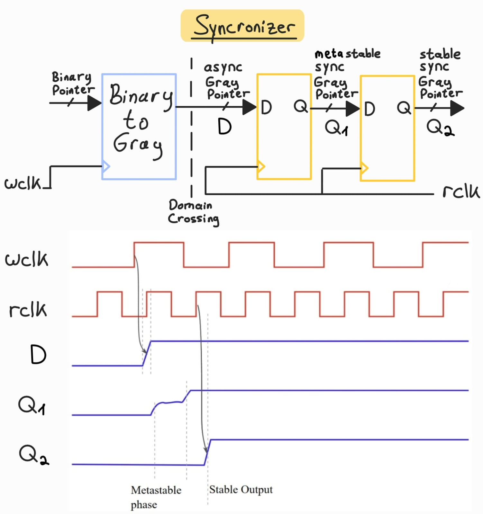
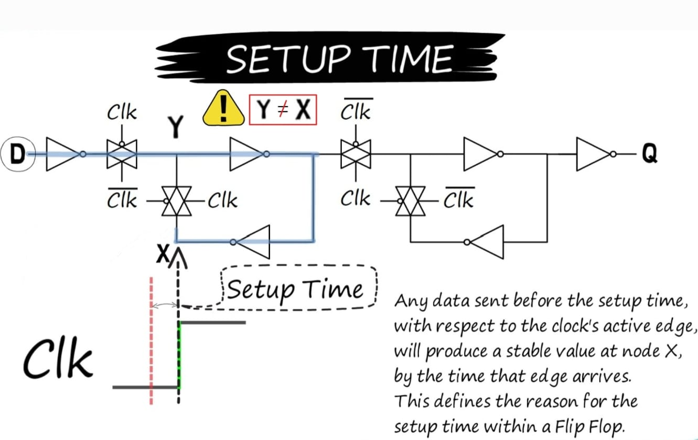
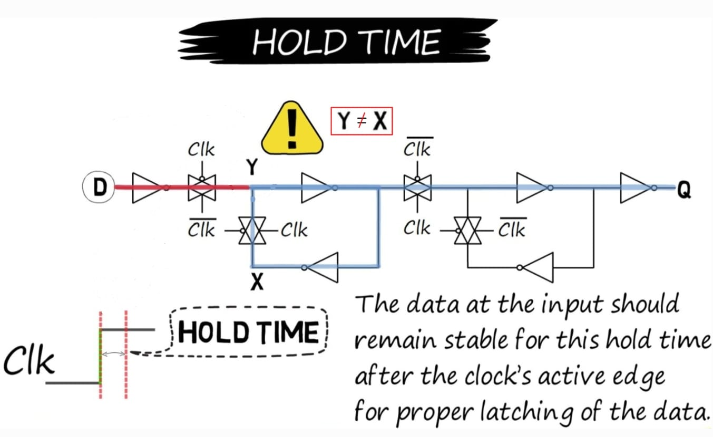
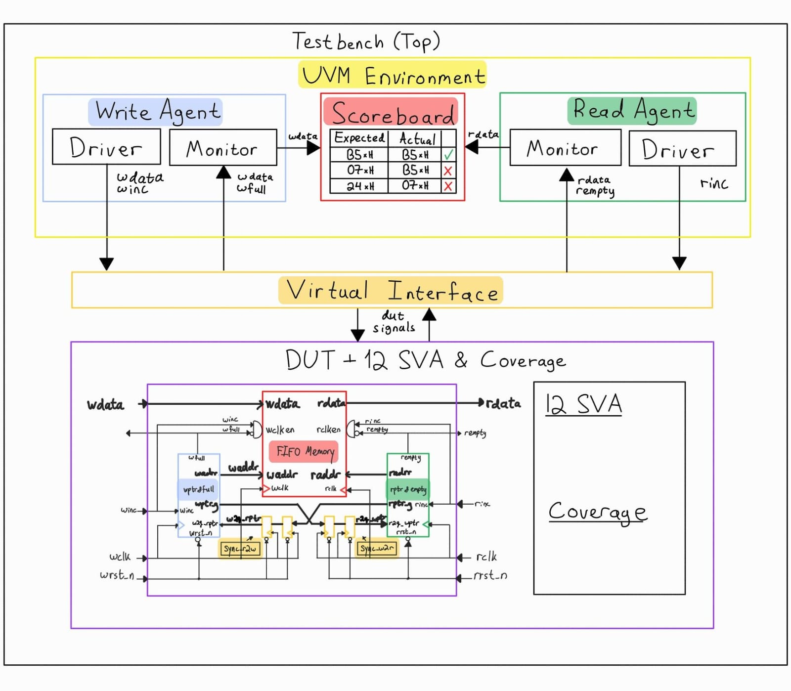
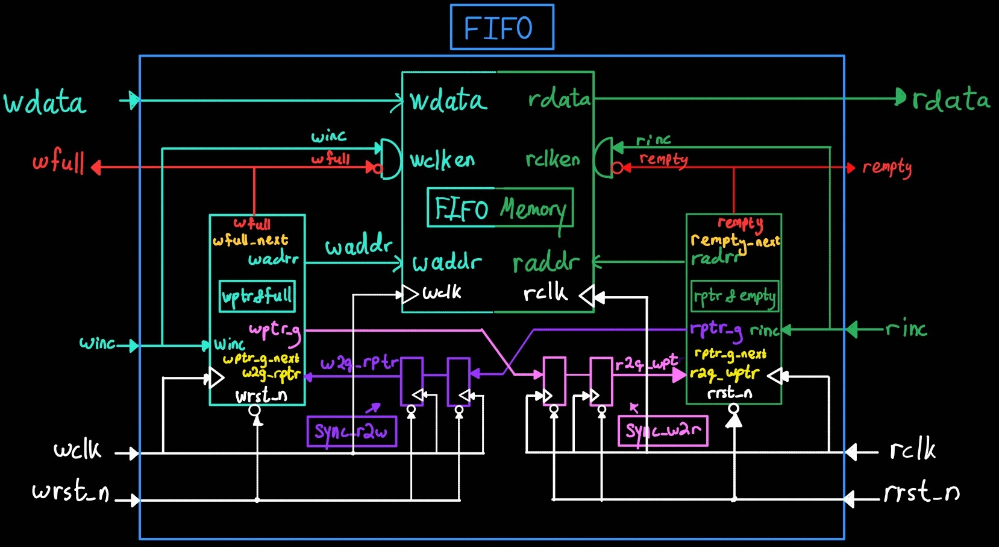

# Asynchronous FIFO Design & UVM Verification Environment


---

# Table of Contents
- [1. Project Overview](#1-project-overview)
  - [Summary](#summary)
  - [What is a FIFO?](#what-is-a-fifo)
  - [Why Asynchronous FIFOs Matter](#why-asynchronous-fifos-matter)
  - [Project Directory Structure](#project-directory-structure)
- [2. FIFO Architecture & Functionality](#2-fifo-architecture--functionality)
  - [Top-Level Architecture](#top-level-architecture)
  - [How the FIFO Works](#how-the-fifo-works)
- [3. Clock Domain Crossing (CDC) & Synchronization Architecture](#3-clock-domain-crossing-cdc--synchronization-architecture)
  - [Gray Code Encoding](#31-gray-code-encoding)
  - [Preventing Metastability (Synchronizers)](#32-preventing-metastability-synchronizers)
  - [Synchronization Latency & Safe Flag Pessimism](#33-synchronization-latency--safe-flag-pessimism)
- [4. UVM Verification Environment](#4-uvm-verification-environment)
  - [Why a Simple Testbench is Insufficient](#why-a-simple-testbench-is-insufficient)
  - [UVM Testbench Architecture](#uvm-testbench-architecture)
  - [Testbench Signal Map](#testbench-signal-map)
- [5. SystemVerilog Assertions (SVA) & Coverage](#5-systemverilog-assertions-sva--coverage)
  - [SystemVerilog Assertions (SVA - 12 Safety Checkers)](#systemverilog-assertions-sva---12-safety-checkers)
  - [Functional & Structural Code Coverage](#functional--structural-code-coverage)
  - [Verification Trace Matrix (Features Verified)](#verification-trace-matrix-features-verified)
  - [Coverage Results](#coverage-results)
- [6. Waveform Analysis & Simulation Guide](#6-waveform-analysis--simulation-guide)
  - [Read & Write Transactions](#read--write-transactions)
  - [Quick Start & Simulation Guide](#quick-start--simulation-guide)

---

# 1. Project Overview

### Summary
This project implements a parameterized dual-clock asynchronous FIFO in VHDL for safe data transfer across independent clock domains (CDC). The design is fully verified using a SystemVerilog UVM environment with SVA assertions and 100% coverage.

### What is a FIFO?
A FIFO (First-In, First-Out) is a hardware data buffer where the first piece of data written into the memory is the first piece of data read out, acting like a queue. An **asynchronous** FIFO has independent clocks for writing and reading, allowing systems operating at different speeds to communicate.

### Why Asynchronous FIFOs Matter
Modern digital chips operate different modules with independent clock frequencies. Asynchronous FIFOs serve as critical data bridges between these clock domains, ensuring fast and reliable data transfer without data loss or corruption.

### Project Directory Structure

```text
FIFO/
│
├── rtl/
│   ├── fifo.vhd
│   ├── fifo_mem.vhd
│   ├── fifo_r_ptr.vhd
│   ├── fifo_w_ptr.vhd
│   └── fifo_synchronizer.vhd
│
├── uvm/
│   ├── fifo_env.sv
│   ├── fifo_if.sv
│   ├── fifo_pkg.sv
│   ├── fifo_r_agent.sv
│   ├── fifo_r_drain_sequence.sv
│   ├── fifo_r_driver.sv
│   ├── fifo_r_monitor.sv
│   ├── fifo_r_sequence.sv
│   ├── fifo_reset_recovery_test.sv
│   ├── fifo_scoreboard.sv
│   ├── fifo_sva.sv
│   ├── fifo_tb.sv
│   ├── fifo_test.sv
│   ├── fifo_top.sv
│   ├── fifo_transaction.sv
│   ├── fifo_w_agent.sv
│   ├── fifo_w_burst_sequence.sv
│   ├── fifo_w_driver.sv
│   ├── fifo_w_monitor.sv
│   └── fifo_w_sequence.sv
│
└── sim/
    ├── run.do
    ├── run.ps1
    └── run.bat
```

---

# 2. FIFO Architecture & Functionality

## Top-Level Architecture


### How the FIFO Works

An asynchronous FIFO acts as a temporary queue for transferring data between two independent clock domains (Write domain and Read domain):

1. **Writing Data:** When a write is requested and the buffer is not full, data is written into memory at the write address, and the write pointer increments.
2. **Reading Data:** When a read is requested and the buffer is not empty, data is retrieved from memory at the read address, and the read pointer increments.
3. **Full & Empty Status Flags:**
   - **Empty:** Triggered when the read pointer catches up to the synchronized write pointer (all data has been read out).
   - **Full:** Triggered when the write pointer wraps around and catches up to the synchronized read pointer (buffer is completely filled).
4. **CDC Pointer Transfer:** Pointers are converted to Gray code and passed through 2-stage flip-flop (2FF) synchronizers, allowing safe cross-domain comparison without sampling skew or metastability.

---

# 3. Clock Domain Crossing (CDC) & Synchronization Architecture

Asynchronous clock domain crossings (CDC) pose two fundamental hardware challenges: **multi-bit pointer skew** and **metastability**. Below is a detailed breakdown of how this FIFO design mitigates both risks.



---

## 3.1 Gray Code Encoding

### Problem: Multi-Bit Skew Corruption
In a clock domain crossing, transferring multi-bit pointers is dangerous due to **wire/routing skew** and differences in path delays.

When a binary pointer increments, multiple bits often change simultaneously. For example, when a 3-bit binary pointer transitions from `3` (`011`) to `4` (`100`), all three bits must toggle. Due to routing skew, these bit transitions arrive at destination flip-flops at slightly different times. If the destination clock samples the pointer mid-transition, it can capture arbitrary intermediate corrupted values, leading to false full/empty flag assertions or corrupted pointer logic.

| Current Binary State | Next Binary State | Sampled Intermediate Values |
| :---: | :---: | :---: |
| **`011`** (3) | **`100`** (4) | `111` (7), `000` (0), `001` (1), `101` (5), `110` (6), `010` (2) |

### Solution: Single-Bit Toggle (Gray Code)
To guarantee CDC safety, pointer values are converted to **Gray Code** prior to domain crossing. In Gray code, consecutive numerical values differ by **exactly one bit**.

$$\text{Binary } 3 \rightarrow 4 \quad \Longleftrightarrow \quad \text{Gray } 010 \rightarrow 110$$

Since only a single bit toggles during pointer increment:
- There are **no multi-bit intermediate or transient states** to sample.
- If the receiving clock samples the signal precisely during a bit transition, the sampled result will resolve to either the **previous state** (`010`) or the **new state** (`110`).
- Both are valid, coherent pointer states. Sampling the old value simply delays flag assertion by one destination clock cycle (safe pessimism) without corrupting memory management logic.

### Implementation: Binary-to-Gray Converter

$$\text{G} = \text{B} \text{ xor } (\text{B} \gg 1)$$

---

## 3.2 Preventing Metastability (Synchronizers)

### Problem: Setup/Hold Timing Violations
Even with Gray-coded pointers, a single transitioning bit can still violate the setup or hold timing requirements of the receiving flip-flop, leading to **metastability**.

Flip-flops require input signals to remain stable during a setup and hold window around the active clock edge. Asynchronous clocks render these violations inevitable, leaving internal latch nodes at an unstable intermediate voltage state ($V_{DD}/2$) that can cause output oscillations.

#### How Metastability Occurs (Internal Flip-Flop Dynamics)

* **1. Before Clock Edge:** Input $D$ is latched on node $X$.  
  

* **2. After Clock Edge:** Node $X$ is transferred to output $Q$.  
  

* **3. The Metastable State:** Node X and node Y end up with conflicting voltage levels post-edge. Node X drives node Y through Transmission Gate 2 (with delay), while node Y drives node X back through the dual-inverter feedback path. Because their states conflict, both nodes get trapped at an intermediate voltage level ($V_{DD}/2$), causing output $Q$ to remain metastable until noise resolves the loop.  
  

* **4. Setup Violation:** Occurs if input $D$ changes too late before the clock edge. $D$ reaches node $Y$ but fails to propagate to node $X$ before sampling, causing node $X$ to retain its previous state different from the new $D$ value.  
  

* **5. Hold Violation:** Occurs if input $D$ changes after the clock edge before Transmission Gate 1 completely isolates the input stage, altering node $Y$ and mismatching latched node $X$.  
  

---

### Solution: Synchronizers (2FF)
To prevent metastable outputs from propagating into internal control logic, Gray-coded pointers pass through **2-Stage Flip-Flop Chains** granting a full clock cycle of resolution time for any metastable state to decay


1. **Stage 1 ($Q_1$):** Samples the raw asynchronous Gray pointer. If a setup/hold violation occurs, $Q_1$ may become metastable.
2. **Resolution Window ($t_r$):** $Q_1$ is granted a full destination clock cycle for its internal node voltages to decay to a deterministic digital '0' or '1'.
3. **Stage 2 ($Q_2$):** Samples the settled output of $Q_1$. Because the probability of $Q_1$ remaining metastable for a full clock cycle is exponentially low, $Q_2$ creates a clean, synchronized signal.

#### Mean Time Between Failures (MTBF)
The reliability of a synchronizer chain is quantified by its MTBF, which increases exponentially with the resolution time ($t_r$):

$$\text{MTBF} = \frac{e^{s \cdot t_r}}{T_0 \cdot f_{\text{clk}} \cdot f_{\text{data}}}$$

| Parameter | Description |
| :--- | :--- |
| **$t_r$** | Available settling time ($T_{\text{clk}} - t_{su}$) |
| **$s$** | Resolution time constant of the process node |
| **$T_0$** | Deep-metastability aperture factor |
| **$f_{\text{clk}}$ / $f_{\text{data}}$** | Destination clock frequency and incoming Gray pointer toggle rate |

The insertion of $Q_2$ expands $t_r$ by nearly an entire clock period, which can boost MTBF from seconds to years.

---

## 3.3 Synchronization Latency & Safe Flag Pessimism

Passing pointers across asynchronous clock domains via 2FF synchronizers introduces a **2 clock cycle delay**. Because pointers are compared against slightly delayed values from the opposite domain, status flags operate with a **safe, pessimistic bias**:

- **`wfull` Pessimism:** Compares write pointer to a read pointer that is 2 cycles old. The write domain may see the FIFO as "Full" slightly longer than it actually is (if reads occurred during synchronization).
  * **Safety Impact:** Prevents **overflow** (overwriting data), at the cost of a temporary pause in write throughput.

- **`rempty` Pessimism:** Compares read pointer to a write pointer that is 2 cycles old. The read domain may see the FIFO as "Empty" slightly longer than it actually is (if writes occurred during synchronization).
  * **Safety Impact:** Prevents **underflow** (reading garbage data), at the cost of a 2-cycle latency delay before newly written data can be read out.

---

# 4. UVM Verification Environment

## Why a Simple Testbench is Insufficient

A standard testbench focuses on toggling individual pins, making it difficult to handle the multiple clock domains and unpredictable timing of an asynchronous FIFO. To avoid debugging race conditions in the test code itself, we use SystemVerilog UVM to elevate the abstraction from "wiggling pins" to "sending transactions".

### The Core Advantages of UVM:

1. **Modularity:** UVM strictly isolates data generation, pin driving, and result checking into different components. This allows us to easily change one component without affecting the others.
2. **Standardized Communication:** UVM libraries provide Transaction Level Modeling (TLM). Standardizing communication guarantees data is passed safely between testbench components without race conditions.
3. **Scalability:** Scaling vertically or horizontally is trivial. We can easily add more FIFOs into the same testing enviroment by copying the agents and connecting them to the new fifo. Alternatively, we can integrate this FIFO into a larger SoC, by plugging the testbench into a larger verification environment without modification.

---

## UVM Testbench Architecture



The testbench operates using five primary UVM components:
- **Agents:** The managers of a specific clock domain. They encapsulate the data generation, driving, and monitoring activity for their respective sides of the FIFO.
- **Drivers:** Drive DUT input signals.
- **Monitors:** Monitor hardware signals and send them to the scoreboard.
- **Scoreboard:** Records data pushed into the FIFO and compares it against data popped out to verify zero data corruption.
- **Virtual Interface:** Allows the testbench to drive and monitor signals on the DUT's pins.

### 🚚 UVM Logistics & Factory Analogy


Beyond these five primary components, the testbench relies on several smaller elements like sequences and transactions to function. Below is a comprehensive explanation of how all these parts work together to verify the FIFO, using a shipping container logistics analogy:

| Analogy | UVM Concept | Role in FIFO Verification |
| :--- | :--- | :--- |
| **📦 Write Container** | **Write Transaction** | Inbound data payload (`wdata`) driven into the FIFO. |
| **📦 Read Container** | **Read Transaction** | Outbound data payload (`rdata`) popped from the FIFO. |
| **📋 Write Order List** | **Write Sequence** | Generates planned write traffic (e.g., burst writes until `wfull`). |
| **📋 Read Order List** | **Read Sequence** | Generates planned read requests (e.g., burst reads until `rempty`). |
| **🏗️ Input Dock** | **Write Sequencer** | Queues write containers for the supplier truck. |
| **🏗️ Output Dock** | **Read Sequencer** | Queues read request triggers for the pickup truck. |
| **🚚 Supplier Truck** | **Write Driver** | Drives write signals (`winc`, `wdata`) onto the write interface. |
| **🚚 Pickup Truck** | **Read Driver** | Drives read request signals (`rinc`) onto the read interface. |
| **🟨 Supplier Logistics** | **Write Agent** | Groups Write Sequencer, Driver, and Monitor for the write clock domain (`wclk`). |
| **🟩 Customer Logistics** | **Read Agent** | Groups Read Sequencer, Driver, and Monitor for the read clock domain (`rclk`). |
| **🛣️ Write Highway** | **Write Interface** | Write clock domain wires (`wclk`, `wrst_n`, `winc`, `wdata`, `wfull`). |
| **🛣️ Read Highway** | **Read Interface** | Read clock domain wires (`rclk`, `rrst_n`, `rinc`, `rdata`, `rempty`). |
| **📷 Entry Camera** | **Write Monitor** | Scans inbound containers entering the FIFO and sends expected logs to Accounting Office. |
| **📷 Exit Camera** | **Read Monitor** | Scans outbound containers leaving the FIFO and sends actual logs to Accounting Office. |
| **📊 Accounting Office** | **Scoreboard** | Compares Expected (Write) vs Actual (Read) containers to verify data integrity (**PASS/FAIL**). |

### Testbench Signal Map

To get into the specifics, below is a table that explains how each hardware signal is influenced by each component in the UVM testbench.

| Signal | Declared In | Driven By | Sampled By |
| :--- | :--- | :--- | :--- |
| **`wclk`, `rclk`** | [`uvm/fifo_top.sv`](uvm/fifo_top.sv) | **`fifo_top`** (`always` statement) | DUT, Interface Clocking Blocks |
| **`wrst_n`, `rrst_n`** | [`uvm/fifo_if.sv`](uvm/fifo_if.sv) | **`fifo_top`** (Initial Time-0) & **`fifo_test`** / **`fifo_reset_recovery_test`** (Mid-traffic reset) | DUT, Drivers, Monitors, SVA |
| **`winc`, `wdata`** | [`uvm/fifo_if.sv`](uvm/fifo_if.sv) | **`fifo_w_driver`**  | DUT, `fifo_w_monitor`, SVA |
| **`rinc`** | [`uvm/fifo_if.sv`](uvm/fifo_if.sv) | **`fifo_r_driver`** | DUT, `fifo_r_monitor`, SVA |
| **`wfull`, `rempty`, `rdata`** | [`uvm/fifo_if.sv`](uvm/fifo_if.sv) | **FIFO DUT** | Drivers, Monitors, Scoreboard, Test cases |
| **`wclken_wire`, `rclken_wire`** | [`uvm/fifo_if.sv`](uvm/fifo_if.sv) | **FIFO DUT** (via **`fifo_connector`** bridge) | Monitors, SVA |

---

# 5. SystemVerilog Assertions (SVA) & Coverage

## SystemVerilog Assertions (SVA - 12 Safety Checkers)

The verification environment contains **12 concurrent and immediate SystemVerilog Assertions** to check the safety and correctness of the design protocol in real time:

1. **Write Domain Reset:** Asserts that when the write reset (`wrst_n`) is active, all write pointers (`waddr`, binary, Gray) and the `wfull` flag are correctly initialized to `0`.
2. **Read Domain Reset:** Asserts that when the read reset (`rrst_n`) is active, all read pointers (`raddr`, binary, Gray) are initialized to `0` and `rempty` is asserted (`1`).
3. **Write Pointer Stability (No Overwrite):** Verifies that if `wfull` is asserted, any subsequent write requests (`winc`) will not increment the write pointers (protects against write overflow).
4. **Read Pointer Stability (No Overread):** Verifies that if `rempty` is asserted, any subsequent read requests (`rinc`) will not increment the read pointers (protects against read underflow).
5. **Write Gray-Code Integrity:** Checks that the write Gray-code pointer changes by only one bit per increment step, ensuring CDC safety.
6. **Read Gray-Code Integrity:** Checks that the read Gray-code pointer changes by only one bit per increment step, ensuring CDC safety.
7. **Empty Flag Generation:** Verifies that when the read Gray pointer equals the synchronized write Gray pointer, the `rempty` flag is asserted.
8. **Full Flag Generation:** Verifies that when the write Gray pointer matches the synchronized read Gray pointer (with the two MSBs inverted), the `wfull` flag is asserted.
9. **Write Enable Gating:** Verifies that the internal write memory enable (`wclken`) is only active when `winc = 1` and `wfull = 0`.
10. **Read Enable Gating:** Verifies that the internal read memory enable (`rclken`) is only active when `rinc = 1` and `rempty = 0`.
11. **Data Integrity Checker:** Compares the read data `rdata` against a golden shadow memory array (`fifo_data`) at the read address to check for data corruption.
12. **Memory Occupancy Bound Check:** Verifies that the modular difference between the write pointer and synchronized read pointer (`w_occupancy`) never exceeds the maximum FIFO `DEPTH`.

---

## Functional & Structural Code Coverage

The verification environment combines **Structural Code Coverage** on the RTL design units with **Functional and Assertion Coverage** defined via SystemVerilog covergroups and SVA.

## Coverage Goals & Coverpoints

The verification plan defines **12 distinct coverpoints and crosses** (split between the write-side and read-side covergroups) to verify correct operation across all FIFO scenarios:

### Write-Side Covergroup (`fifo_w_cg`)
1. **`wfull`**: Coverage of the FIFO Full flag states (Asserted vs. Deasserted).
2. **`w_occupancy`**: Tracks write-side occupancy levels (`empty`, `almost_empty`, `mid_range`, `almost_full`, `full`).
3. **`winc`**: Verifies write command request activation.
4. **`wrst_n`**: Verifies write domain reset states.
5. **Cross `winc` × `wfull`**: Proves write attempts are simulated under both Full and Non-Full conditions (tests overflow protection).
6. **Cross `winc` × `w_occupancy`**: Proves write requests are executed at every possible FIFO fill level.

### Read-Side Covergroup (`fifo_r_cg`)
7. **`rempty`**: Coverage of the FIFO Empty flag states (Asserted vs. Deasserted).
8. **`r_occupancy`**: Tracks read-side occupancy levels (`empty`, `almost_empty`, `mid_range`, `almost_full`, `full`).
9. **`rinc`**: Verifies read command request activation.
10. **`rrst_n`**: Verifies read domain reset states.
11. **Cross `rinc` × `rempty`**: Proves read attempts are simulated under both Empty and Non-Empty conditions (tests underflow protection).
12. **Cross `rinc` × `r_occupancy`**: Proves read requests are executed at every possible FIFO fill level.

## Verification Trace Matrix (Features Verified)

| Verification Scenario | Status | SVA Checker Evidence | Functional Coverage Evidence |
|---|---|---|---|
| **FIFO Full Detection** | ✅ Passed | SVA #8 (Full Flag Generation) | Coverpoint `wfull` |
| **FIFO Empty Detection** | ✅ Passed | SVA #7 (Empty Flag Generation) | Coverpoint `rempty` |
| **Overflow Protection** | ✅ Passed | SVA #3 (Write Pointer Stability), SVA #9 (Write Gating) | Cross `winc` × `wfull` |
| **Underflow Protection** | ✅ Passed | SVA #4 (Read Pointer Stability), SVA #10 (Read Gating) | Cross `rinc` × `rempty` |
| **Simultaneous Read/Write** | ✅ Passed | SVA #11 (Data Integrity Checker) | Crosses `winc` / `rinc` × Occupancy |
| **Pointer Wraparound** | ✅ Passed | SVA #12 (Memory Occupancy Bound Check) | Coverpoints `w_occupancy` / `r_occupancy` |
| **Asynchronous Clock Ratios** | ✅ Passed | SVA #11 (Data Integrity Checker) | Parameterized clock period sweeps |
| **Gray Pointer Correctness** | ✅ Passed | SVA #5, #6 (Gray-Code Integrity) | Coverpoints `wptr_g_cur` / `rptr_g_cur` |
| **Reset Recovery** | ✅ Passed | SVA #1, #2 (Write/Read Domain Reset) | Coverpoints `wrst_n` / `rrst_n` |
| **CDC Synchronization Behavior** | ✅ Passed | SVA #7, #8 (CDC Gray Pointers match) | Synchronized pointer cross tracking |

---

## Coverage Results

| Coverage Type | Target | Status | Result |
|---|---|---|---|
| **Functional Coverage** | Covergroups / Coverpoints | ✅ Covered | 100% |
| **Assertion Coverage** | SystemVerilog Assertions | ✅ Covered | 100% |
| **RTL Code Coverage** | VHDL Design Units | ✅ Covered | 100% |

- **Functional Coverage:** Proves the testbench successfully hit all defined design features and edge cases (e.g., full, empty, write while full).
- **Assertion Coverage:** Confirms all safety checkers (SVA) protecting against overflow, underflow, and logic faults were active and passed.
- **RTL Code Coverage (Structural):** Verifies the simulator executed every physical line, branch path, boolean expression, and signal toggle in the hardware code.

### ModelSim Coverage Dashboard


### Detailed Design Units Coverage Breakdown


---

# 6. Waveform Analysis & Simulation Guide

# Waveforms Colors Match Diagram Signals


---
## Read & Write Transactions 
This waveform demonstrates standard FIFO data path operations. Data is written into the memory array (`wdata`) on the write clock domain when `winc` is asserted. It is subsequently read out (`rdata`) on the read clock domain in a First-In-First-Out sequence. The integrity of the data stream (e.g., `A7`, `5A`, `AF`) is preserved perfectly as it crosses the asynchronous boundary.


### 2. FIFO Full Condition
The FIFO asserts `wfull` when the write pointer catches up to the synchronized read pointer. In Gray code, full occurs when pointers are equal with the two Most Significant Bits (MSBs) inverted.


### 3. FIFO Empty Condition
The FIFO asserts `rempty` when the read pointer catches up to the synchronized write pointer (all bits match).


### 4. Clock Domain Crossing (CDC) Pointer Traces

#### Read-to-Write Domain Synchronization
The read Gray pointer crosses into the write domain through the 2FF synchronizer stages (`q1ptr_g` and `q2ptr_g`) before being evaluated for full condition check.


#### Write-to-Read Domain Synchronization
The write Gray pointer crosses into the read domain through two flip-flop stages before empty condition evaluation.


---

## Quick Start & Simulation Guide

### Dynamic Simulation Parameters

You can dynamically configure **all 4 simulation parameters** at runtime without re-compiling the design:
### Default Simulation Parameters
- **Clocks:** `Wclk` = 5 ns (100 MHz), `Rclk` = 7 ns (~71.4 MHz)
- **FIFO Bus:** `DataWidth` = 8 bits, `AddrWidth` = 4 bits ($\text{Depth} = 16$)

---

### Option 1: Automated Test Runner (Command Line - Quiet Mode)

1. Open terminal and navigate to your `sim` directory:
   ```bash
   cd sim
   ```
2. Run simulation with default or custom parameters:
   ```powershell
   # 1. Run basic test suite (default settings)
   .\run.ps1

   # 2. Custom Parameters Run
   .\run.ps1 -TestName fifo_reset_recovery_test -Wclk 2 -Rclk 10 -DataWidth 16 -AddrWidth 5
   ```

---

### Option 2: Interactive ModelSim GUI (Waveforms)

1. Open ModelSim SE and navigate to your `sim` directory:
   ```bash
   cd sim
   ```
2. Run simulation with default or custom parameters:
   ```bash
   # 1. Run basic test (default settings)
   do run.do

   # 2. Custom Parameters Run
   set TESTNAME fifo_reset_recovery_test; set WCLK_HALF 2; set RCLK_HALF 10; set DATA_WIDTH 5; set ADDR_WIDTH 5; do run.do
   ```

---
### 👨‍💻 Author

**Shlomo Abrams**  
*Electrical Engineering Student | Digital Design & Verification Enthusiast*  
[GitHub](https://github.com/ShlomoAbrams)
