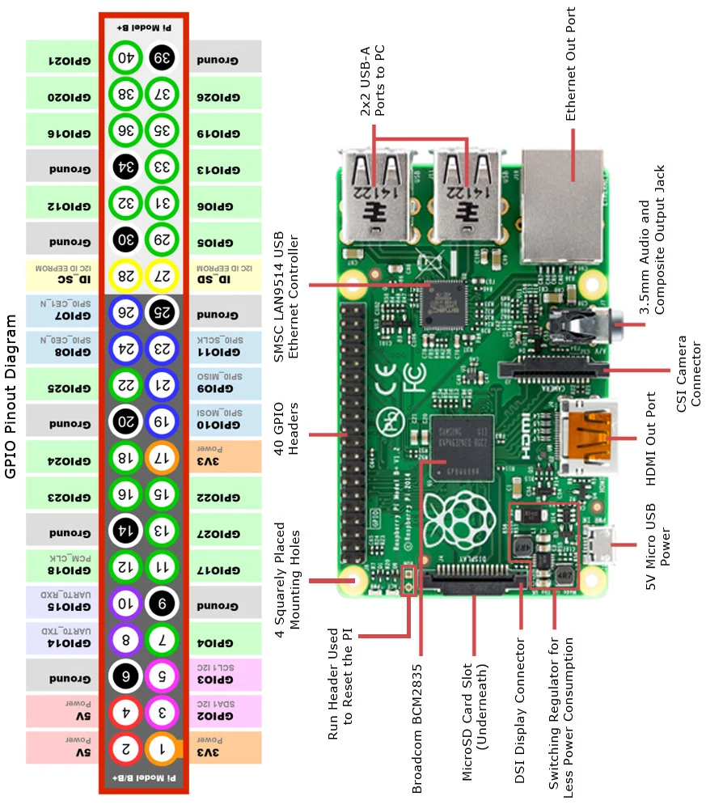

# Raspberry Pi & Basys 3 Hardware-in-the-Loop Setup Guide

This guide details how to wire and test your **Asynchronous Dual-Clock FIFO** implemented on the **Digilent Basys 3 FPGA** using a **Raspberry Pi** as the automated master test controller.

---

## 1. Safety & Voltage Compatibility

> [!IMPORTANT]
> **Logic Level Compatibility**:
> * **Raspberry Pi GPIOs**: 3.3V LVCMOS
> * **Digilent Basys 3 PMODs**: 3.3V LVCMOS (`IOSTANDARD LVCMOS33`)
> * **Result**: 100% directly compatible! **No level-shifter chips are required.**
>
> **CRITICAL RULE: COMMON GROUND**
> You **MUST** connect at least one Ground pin from the Raspberry Pi (e.g., Pin 6 or 14) to the Basys 3 PMOD Ground (Pin 5 or 11 on any PMOD header). Without a common electrical ground, signal readings will float and corrupt data!

---

## 2. Complete Wiring Table ("Parallel Rails" Layout: JB -> JC -> JA)

### Visual Board Orientation:
Orient your Raspberry Pi with the **USB / Ethernet ports facing UP** (away from you) and the **MicroSD slot facing DOWN** (towards you):
The 40-pin header is located along the **LEFT edge** of the board:
* **OUTER RAIL (Left Column &mdash; Even Pins 2..40)**: Along the outer left edge of the PCB.
* **INNER RAIL (Right Column &mdash; Odd Pins 1..39)**: Running along the inside, closer to the metal CPU / SoC.

> [!WARNING]
> **Basys 3 Port Placement**:
> * **Left Side**: Top = **PMOD JA** (Write Bus), Bottom = **PMOD JB** (Read Bus)
> * **Right Side**: Top = **PMOD JC** (Clocks/Flags), Bottom = **JXADC** (Analog &mdash; **LEAVE EMPTY**)
> * **Never connect PMOD Pin 6 or Pin 12 (3.3V power)** &mdash; only connect Pins 1-4, 5 (GND), and 7-10.
> * **RPi Pin 40 is a signal pin (GPIO 21 / rdata[0])** &mdash; do **NOT** connect it to Ground!

> [!NOTE]
> **Universal PMOD Pin-to-Color Scheme**:
> **All PMOD headers (JA, JB, and JC) follow the exact same pin-to-color mapping for all connections:**
> * **Top Row**: Pin 1 = <span style="color: #000; background-color: #e0e0e0; padding: 1px 4px; border-radius: 3px; font-weight: bold;">Black</span>, Pin 2 = <span style="color: #fff; background-color: #424242; padding: 1px 4px; border-radius: 3px; font-weight: bold;">White</span>, Pin 3 = <span style="color: #9e9e9e; font-weight: bold;">Gray</span>, Pin 4 = <span style="color: #ba68c8; font-weight: bold;">Purple</span>, Pin 5 = <span style="color: #29b6f6; font-weight: bold;">Blue (GND)</span>
> * **Bottom Row**: Pin 7 = <span style="color: #bcaaa4; font-weight: bold;">Brown</span>, Pin 8 = <span style="color: #ef5350; font-weight: bold;">Red</span>, Pin 9 = <span style="color: #ffa726; font-weight: bold;">Orange</span>, Pin 10 = <span style="color: #fbc02d; font-weight: bold;">Yellow</span>

<pre style="font-family: Consolas, 'Courier New', monospace; line-height: 1.45;">
                      ▲ TOP: USB / ETHERNET PORTS (Pins 39 & 40) ▲

          OUTER RAIL (Left Column)               INNER RAIL (Right Column)
         [Along Outer Board Edge]                  [Toward Metal CPU / SoC]
     (5-wire bundles + GND references)               (4-wire signal bundles)
   =====================================       ===================================
   <span style="color: #000; background-color: #e0e0e0; padding: 1px 3px; border-radius: 3px;">JB Top rdata[0] - [Pin 40] GPIO21</span>   |  GND   [Pin 39]
   <span style="color: #fff; background-color: #424242; padding: 1px 3px; border-radius: 3px;">JB Top rdata[1] - [Pin 38] GPIO20</span>   | GPIO26 [Pin 37]
   <span style="color: #9e9e9e;">JB Top rdata[2] - [Pin 36] GPIO16</span>   | GPIO19 [Pin 35] - <span style="color: #bcaaa4;">JB Bottom rdata[4]</span>   PMOD JB ZONE
   <span style="color: #29b6f6;">JB Top GND      - [Pin 34]  GND   </span>  | GPIO13 [Pin 33] - <span style="color: #ef5350;">JB Bottom rdata[5]</span>   (Read Bus)
   <span style="color: #ba68c8;">JB Top rdata[3] - [Pin 32] GPIO12</span>   | GPIO6  [Pin 31] - <span style="color: #ffa726;">JB Bottom rdata[6]</span>   (Top Zone)
                     [Pin 30]  GND     | GPIO5  [Pin 29] - <span style="color: #fbc02d;">JB Bottom rdata[7]</span>
   -----------------------------------------------------------------------------------------
                     [Pin 28] ID_SC    | ID_SD  [Pin 27]  (Reserved - Empty)
   <span style="color: #000; background-color: #e0e0e0; padding: 1px 3px; border-radius: 3px;">JC Top winc     - [Pin 26] GPIO7 </span>   |  GND   [Pin 25]
   <span style="color: #fff; background-color: #424242; padding: 1px 3px; border-radius: 3px;">JC Top rinc     - [Pin 24] GPIO8 </span>   | GPIO11 [Pin 23]
   <span style="color: #9e9e9e;">JC Top wrst_n   - [Pin 22] GPIO25</span>   | GPIO9  [Pin 21] - <span style="color: #bcaaa4;">JC Bottom wclk    </span>   PMOD JC ZONE
   <span style="color: #29b6f6;">JC Top GND      - [Pin 20]  GND   </span>  | GPIO10 [Pin 19] - <span style="color: #ef5350;">JC Bottom rclk    </span>   (Clocks/Flags)
   <span style="color: #ba68c8;">JC Top rrst_n   - [Pin 18] GPIO24</span>   |  3.3V  [Pin 17]                        (Middle Zone)
   -----------------------------------------------------------------------------------------
   <span style="color: #000; background-color: #e0e0e0; padding: 1px 3px; border-radius: 3px;">JA Top wdata[0] - [Pin 16] GPIO23</span>   | GPIO22 [Pin 15] - <span style="color: #ffa726;">JC Bottom wfull   </span>
   <span style="color: #29b6f6;">JA Top GND      - [Pin 14]  GND   </span>  | GPIO27 [Pin 13] - <span style="color: #fbc02d;">JC Bottom rempty  </span>
   <span style="color: #fff; background-color: #424242; padding: 1px 3px; border-radius: 3px;">JA Top wdata[1] - [Pin 12] GPIO18</span>   | GPIO17 [Pin 11] - <span style="color: #bcaaa4;">JA Bottom wdata[4]</span>   PMOD JA ZONE
   <span style="color: #9e9e9e;">JA Top wdata[2] - [Pin 10] GPIO15</span>   |  GND   [Pin 9]                         (Write Bus)
   <span style="color: #ba68c8;">JA Top wdata[3] - [Pin 8]  GPIO14</span>   | GPIO4  [Pin 7]  - <span style="color: #ef5350;">JA Bottom wdata[5]</span>   (Bottom Zone)
                     [Pin 6]   GND     | GPIO3  [Pin 5]  - <span style="color: #ffa726;">JA Bottom wdata[6]</span>
                     [Pin 4]   5V      | GPIO2  [Pin 3]  - <span style="color: #fbc02d;">JA Bottom wdata[7]</span>
                     [Pin 2]   5V      |  3.3V  [Pin 1]

                     ▼ BOTTOM: MicroSD CARD SLOT (Pins 1 & 2) ▼
</pre>

### Visual Pinout References:

---

## 3. Step-by-Step Bundle Wiring

Connect your wires in **6 clean bundles** from Top to Bottom (every PMOD header uses the exact same wire color scheme for its pin connections):

### Zone 1: PMOD JB (Read Data Bus `rdata[7:0]`) &mdash; Top of RPi (near Pin 40)

#### Bundle 1 &mdash; JB Top Row (5 wires on Outer Rail &mdash; Left Column):
| RPi Physical Pin | RPi GPIO | Basys 3 Pin | FPGA Signal |
| :--- | :--- | :--- | :--- |
| <span style="color: #000; background-color: #e0e0e0; padding: 1px 4px; border-radius: 3px;">**Pin 40**</span> | <span style="color: #000; background-color: #e0e0e0; padding: 1px 4px; border-radius: 3px;">GPIO 21</span> | <span style="color: #000; background-color: #e0e0e0; padding: 1px 4px; border-radius: 3px;">**JB1**</span> | <span style="color: #000; background-color: #e0e0e0; padding: 1px 4px; border-radius: 3px;">`rdata[0]`</span> |
| <span style="color: #fff; background-color: #424242; padding: 1px 4px; border-radius: 3px;">**Pin 38**</span> | <span style="color: #fff; background-color: #424242; padding: 1px 4px; border-radius: 3px;">GPIO 20</span> | <span style="color: #fff; background-color: #424242; padding: 1px 4px; border-radius: 3px;">**JB2**</span> | <span style="color: #fff; background-color: #424242; padding: 1px 4px; border-radius: 3px;">`rdata[1]`</span> |
| <span style="color: #9e9e9e;">**Pin 36**</span> | <span style="color: #9e9e9e;">GPIO 16</span> | <span style="color: #9e9e9e;">**JB3**</span> | <span style="color: #9e9e9e;">`rdata[2]`</span> |
| <span style="color: #29b6f6;">**Pin 34**</span> | <span style="color: #29b6f6;">**GND**</span> | <span style="color: #29b6f6;">**JB5**</span> | <span style="color: #29b6f6;">**GND Reference**</span> |
| <span style="color: #ba68c8;">**Pin 32**</span> | <span style="color: #ba68c8;">GPIO 12</span> | <span style="color: #ba68c8;">**JB4**</span> | <span style="color: #ba68c8;">`rdata[3]`</span> |

#### Bundle 2 &mdash; JB Bottom Row (4 wires on Inner Rail &mdash; Right Column):
| RPi Physical Pin | RPi GPIO | Basys 3 Pin | FPGA Signal |
| :--- | :--- | :--- | :--- |
| <span style="color: #bcaaa4;">**Pin 35**</span> | <span style="color: #bcaaa4;">GPIO 19</span> | <span style="color: #bcaaa4;">**JB7**</span> | <span style="color: #bcaaa4;">`rdata[4]`</span> |
| <span style="color: #ef5350;">**Pin 33**</span> | <span style="color: #ef5350;">GPIO 13</span> | <span style="color: #ef5350;">**JB8**</span> | <span style="color: #ef5350;">`rdata[5]`</span> |
| <span style="color: #ffa726;">**Pin 31**</span> | <span style="color: #ffa726;">GPIO 6</span> | <span style="color: #ffa726;">**JB9**</span> | <span style="color: #ffa726;">`rdata[6]`</span> |
| <span style="color: #fbc02d;">**Pin 29**</span> | <span style="color: #fbc02d;">GPIO 5</span> | <span style="color: #fbc02d;">**JB10**</span> | <span style="color: #fbc02d;">`rdata[7]`</span> |

---

### Zone 2: PMOD JC (Clocks, Resets & Flags) &mdash; Middle of RPi (Pins 13..26)

#### Bundle 3 &mdash; JC Top Row (5 wires on Outer Rail &mdash; Left Column):
| RPi Physical Pin | RPi GPIO | Basys 3 Pin | FPGA Signal |
| :--- | :--- | :--- | :--- |
| <span style="color: #000; background-color: #e0e0e0; padding: 1px 4px; border-radius: 3px;">**Pin 26**</span> | <span style="color: #000; background-color: #e0e0e0; padding: 1px 4px; border-radius: 3px;">GPIO 7</span> | <span style="color: #000; background-color: #e0e0e0; padding: 1px 4px; border-radius: 3px;">**JC1**</span> | <span style="color: #000; background-color: #e0e0e0; padding: 1px 4px; border-radius: 3px;">`winc` (Write Enable)</span> |
| <span style="color: #fff; background-color: #424242; padding: 1px 4px; border-radius: 3px;">**Pin 24**</span> | <span style="color: #fff; background-color: #424242; padding: 1px 4px; border-radius: 3px;">GPIO 8</span> | <span style="color: #fff; background-color: #424242; padding: 1px 4px; border-radius: 3px;">**JC2**</span> | <span style="color: #fff; background-color: #424242; padding: 1px 4px; border-radius: 3px;">`rinc` (Read Enable)</span> |
| <span style="color: #9e9e9e;">**Pin 22**</span> | <span style="color: #9e9e9e;">GPIO 25</span> | <span style="color: #9e9e9e;">**JC3**</span> | <span style="color: #9e9e9e;">`wrst_n` (Write Reset)</span> |
| <span style="color: #29b6f6;">**Pin 20**</span> | <span style="color: #29b6f6;">**GND**</span> | <span style="color: #29b6f6;">**JC5**</span> | <span style="color: #29b6f6;">**GND Reference**</span> |
| <span style="color: #ba68c8;">**Pin 18**</span> | <span style="color: #ba68c8;">GPIO 24</span> | <span style="color: #ba68c8;">**JC4**</span> | <span style="color: #ba68c8;">`rrst_n` (Read Reset)</span> |

#### Bundle 4 &mdash; JC Bottom Row (4 wires on Inner Rail &mdash; Right Column):
| RPi Physical Pin | RPi GPIO | Basys 3 Pin | FPGA Signal |
| :--- | :--- | :--- | :--- |
| <span style="color: #bcaaa4;">**Pin 21**</span> | <span style="color: #bcaaa4;">GPIO 9</span> | <span style="color: #bcaaa4;">**JC7**</span> | <span style="color: #bcaaa4;">`wclk` (Write Clock)</span> |
| <span style="color: #ef5350;">**Pin 19**</span> | <span style="color: #ef5350;">GPIO 10</span> | <span style="color: #ef5350;">**JC8**</span> | <span style="color: #ef5350;">`rclk` (Read Clock)</span> |
| <span style="color: #ffa726;">**Pin 15**</span> | <span style="color: #ffa726;">GPIO 22</span> | <span style="color: #ffa726;">**JC9**</span> | <span style="color: #ffa726;">`wfull` (Full Flag)</span> |
| <span style="color: #fbc02d;">**Pin 13**</span> | <span style="color: #fbc02d;">GPIO 27</span> | <span style="color: #fbc02d;">**JC10**</span> | <span style="color: #fbc02d;">`rempty` (Empty Flag)</span> |

---

### Zone 3: PMOD JA (Write Data Bus `wdata[7:0]`) &mdash; Bottom of RPi (near Pin 1)

#### Bundle 5 &mdash; JA Top Row (5 wires on Outer Rail &mdash; Left Column):
| RPi Physical Pin | RPi GPIO | Basys 3 Pin | FPGA Signal |
| :--- | :--- | :--- | :--- |
| <span style="color: #000; background-color: #e0e0e0; padding: 1px 4px; border-radius: 3px;">**Pin 16**</span> | <span style="color: #000; background-color: #e0e0e0; padding: 1px 4px; border-radius: 3px;">GPIO 23</span> | <span style="color: #000; background-color: #e0e0e0; padding: 1px 4px; border-radius: 3px;">**JA1**</span> | <span style="color: #000; background-color: #e0e0e0; padding: 1px 4px; border-radius: 3px;">`wdata[0]`</span> |
| <span style="color: #29b6f6;">**Pin 14**</span> | <span style="color: #29b6f6;">**GND**</span> | <span style="color: #29b6f6;">**JA5**</span> | <span style="color: #29b6f6;">**GND Reference**</span> |
| <span style="color: #fff; background-color: #424242; padding: 1px 4px; border-radius: 3px;">**Pin 12**</span> | <span style="color: #fff; background-color: #424242; padding: 1px 4px; border-radius: 3px;">GPIO 18</span> | <span style="color: #fff; background-color: #424242; padding: 1px 4px; border-radius: 3px;">**JA2**</span> | <span style="color: #fff; background-color: #424242; padding: 1px 4px; border-radius: 3px;">`wdata[1]`</span> |
| <span style="color: #9e9e9e;">**Pin 10**</span> | <span style="color: #9e9e9e;">GPIO 15</span> | <span style="color: #9e9e9e;">**JA3**</span> | <span style="color: #9e9e9e;">`wdata[2]`</span> |
| <span style="color: #ba68c8;">**Pin 8**</span> | <span style="color: #ba68c8;">GPIO 14</span> | <span style="color: #ba68c8;">**JA4**</span> | <span style="color: #ba68c8;">`wdata[3]`</span> |

#### Bundle 6 &mdash; JA Bottom Row (4 wires on Inner Rail &mdash; Right Column):
| RPi Physical Pin | RPi GPIO | Basys 3 Pin | FPGA Signal |
| :--- | :--- | :--- | :--- |
| <span style="color: #bcaaa4;">**Pin 11**</span> | <span style="color: #bcaaa4;">GPIO 17</span> | <span style="color: #bcaaa4;">**JA7**</span> | <span style="color: #bcaaa4;">`wdata[4]`</span> |
| <span style="color: #ef5350;">**Pin 7**</span> | <span style="color: #ef5350;">GPIO 4</span> | <span style="color: #ef5350;">**JA8**</span> | <span style="color: #ef5350;">`wdata[5]`</span> |
| <span style="color: #ffa726;">**Pin 5**</span> | <span style="color: #ffa726;">GPIO 3</span> | <span style="color: #ffa726;">**JA9**</span> | <span style="color: #ffa726;">`wdata[6]`</span> |
| <span style="color: #fbc02d;">**Pin 3**</span> | <span style="color: #fbc02d;">GPIO 2</span> | <span style="color: #fbc02d;">**JA10**</span> | <span style="color: #fbc02d;">`wdata[7]`</span> |

---

## 4. Running the Test on the Raspberry Pi

1. Copy [`rpi_fifo_tester.py`](rpi_fifo_tester.py) to your Raspberry Pi:
   ```bash
   scp rpi/rpi_fifo_tester.py pi@<raspberry-pi-ip>:~/
   ```

2. On the Raspberry Pi, make sure the GPIO library is installed:
   ```bash
   sudo apt update
   sudo apt install -y python3-rpi.gpio
   ```

3. Power up the **Basys 3** and program it with the generated bitstream (`basys3_fifo_top.bit`).
   - You should see **`LED[1]`** light up on the board (indicating the FIFO is initialized as **EMPTY**).

4. Run the automated hardware test suite on the Raspberry Pi:
   ```bash
   python3 rpi_fifo_tester.py
   ```

### What the test performs:
- **Test 1**: Asserts asynchronous reset and checks that `rempty == 1` and `wfull == 0`.
- **Test 2**: Writes a single byte (`0xA5`), verifies `rempty` drops to `0`, reads it back, verifies byte-for-byte equality, and checks that `rempty` goes back to `1`.
- **Test 3**: Burst-writes 16 consecutive test bytes (`0x10..0x1F`) to completely fill the FIFO and asserts `wfull == 1` (`LED[0]` turns on!).
- **Test 4**: Attempts an illegal write when full to verify **overflow protection**.
- **Test 5**: Burst-reads all 16 bytes back, verifies strict FIFO ordering, and confirms `rempty` asserts and `wfull` deasserts.
